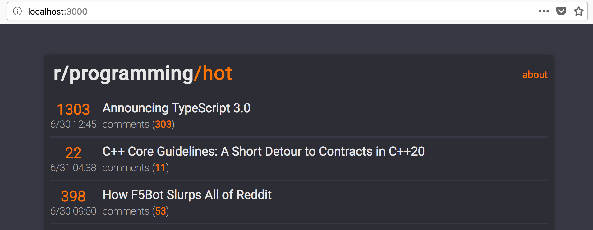

# [node-reddit-api](https://github.com/dyllandry/node-reddit-api)
This project was [Dylan Landry's](https://github.com/dyllandry) first time *successfully* utilizing an API.

## What it Does
Lists the 25 hot posts from [r/Programming](https://www.reddit.com/r/programming/hot) in your browser, including score, date, and title. [Github Repository](https://github.com/dyllandry/node-reddit-api)

## Prerequisites
- Install [Node.js](https://nodejs.org/en/)
    - Make sure it's in your PATH variable, but it should be by default.

## Install
1. Use terminal to navigate to the directory this README is in.
1. Execute `npm install` to install necessary packages.

## Usage
1. Use terminal to navigate to the directory this README is in.
1. Execute `npm start`

## Contribute
Contributions to the readability and simplicity of my code are welcomed. Just submit a pull request!

## Credits
Thanks to the authors of each guide, tutorial, and resource which made it possible to produce his project. Best of luck to those on similar paths as myself. I wish them all perserverance in the face of learning to code <3.

## License

MIT License

Copyright (c) 2018 Dylan Landry

Permission is hereby granted, free of charge, to any person obtaining a copy
of this software and associated documentation files (the "Software"), to deal
in the Software without restriction, including without limitation the rights
to use, copy, modify, merge, publish, distribute, sublicense, and/or sell
copies of the Software, and to permit persons to whom the Software is
furnished to do so, subject to the following conditions:

The above copyright notice and this permission notice shall be included in all
copies or substantial portions of the Software.

THE SOFTWARE IS PROVIDED "AS IS", WITHOUT WARRANTY OF ANY KIND, EXPRESS OR
IMPLIED, INCLUDING BUT NOT LIMITED TO THE WARRANTIES OF MERCHANTABILITY,
FITNESS FOR A PARTICULAR PURPOSE AND NONINFRINGEMENT. IN NO EVENT SHALL THE
AUTHORS OR COPYRIGHT HOLDERS BE LIABLE FOR ANY CLAIM, DAMAGES OR OTHER
LIABILITY, WHETHER IN AN ACTION OF CONTRACT, TORT OR OTHERWISE, ARISING FROM,
OUT OF OR IN CONNECTION WITH THE SOFTWARE OR THE USE OR OTHER DEALINGS IN THE
SOFTWARE.

